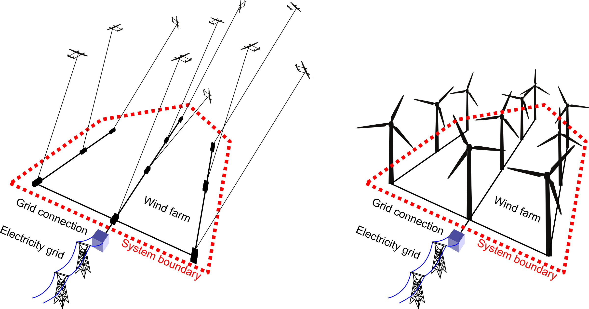

# Life Cycle Inventory and Life Cycle Impact Assessment Models of Comparable 50 Megawatt Conventional Wind and Airborne Wind Energy Farms

Life cycle inventory (LCI) and life cycle impact assessment (LCIA) models of two comparable 50 MW wind farms consisting of 10 horizontal-axis wind turbines (HAWT) and 10 airborne wind energy systems (AWES), respectively. The AWES data was determined by scaling the implemented 150 kW prototype AP3 of Ampyx Power up to a rated power of 5 MW. The HAWT data was taken from the NREL 5 MW reference wind turbine. The dataset and internal relations are provided as an MS Excel file. 

## Introduction

The dataset was generated during the graduation project of Luuk van Hagen [[1]](#References) using own engineering estimations and data and information provided by industry partner Ampyx Power B.V. The objective of this research was to assess the global warming potential (GWP) and other environmental impacts of future multi-MW AWES and to compare these impacts to those of HAWT systems. For the purpose of comparison, an arrangement of 10 systems of 5 MW rated power each in a wind farm was chosen. The research also assessed the environmental impact hotspots within the AWES. The key findings of the graduation project were published as a deliverable report for the Interreg NWE project MegaAWE [[2]](#References). The dataset is underlying the peer-reviewed journal paper [[3]](#References). The dataset was made available in open access for follow-up researchers to use in their own work, with the hope to contribute to improving the position of AWE and increasing sustainability in the wind energy sector.

## Data Description

This research was performed using a large MS Excel mode. The majority of the input on impacts came from the [EcoInvent database (v3.6)](https://ecoinvent.org/the-ecoinvent-database/data-releases/ecoinvent-3-6/), extracted using the [SimaPro LCA software (v9.2)](https://simapro.com/wp-content/uploads/2021/07/FullUpdateInstructionsToSimaPro920.pdf). 
Certain sheets of the MS Excel file were exclusively used for gathering input to the model, while others were used for calculations and yet others were used for output communication. The description of the data follows the individual sheets of the MS Excel file, from left to right.

*Disclaimer: During the graduation project this file was assembled step-by-step without the intention of later publication. Towards the end of the project the file was not as ordered and structured anymore as it could have been, with more time available. We still hope that you manage to gain insight from this invaluable collection of data derived from one of the largest implemented AWES prototypes, the Ampyx Power AP3.*

### AWE

Main calculation sheet for AWE, including input variables at the top of the sheet. These include new settings, but also the communication from the impact input sheet. It is followed by calculations specifying the materials used in each component of the design. Subsequently, in the impacts calculations section, the materials are coupled to the material specific impacts, the EOL impacts and the transport impacts. This creates the impacts for all subsystems within the AWE system, and is the basis for the rest.

### HAWT

Main calculation sheet for HAWT, identically composed as the main calculation sheet for AWE.

### Collective input

Calculation sheet primarily for fibre reinforced polymers (FRP) material compositions and for input for a few variables.	

### OEL impact settings

Input sheet for end of life (EOL) impacts used for the collection of EOL impact values for all materials. The values at the top of the page are the ones that were used, and communicated to the rest of the model
			
### Impact settings

Input sheet for all material and manufacturing impacts containing several options that were collected for the environmental impact for each material, to be able to later select the best one to use. The values at the top of the page are the ones that were used, and communicated to the rest of the model.

### Cables

Calculation sheet for cables used to estimate the materials used in cables based on values found in cable product catalogues. 

### Draft calculations

Calculation and data collection sheet used to assess various things, mostly data collection on topics such as the generator, consumables for FRP manufacturing, among others. It also contains a some of the sensitivity analysis.

### HAWT mass

Primarily for visuals. 

### Communication with latex

Output sheet used for generating a list of variables with which the whole LaTex file could be made parametric. This way a start could be made with writing the thesis report while values were not fully set yet. The sheet collects this data from all other sheets. It also contains a the creation of a number of visuals, and the setups for tables that could be copy pasted into LaTex.

### For Graphics1

Primarily for visuals.

### For Graphics

Primarily for visuals.
	
## Authors

* **Luuk van Hagen** - *Assembly of dataset and documentation* - [GitHub](https://github.com/lvanhagen)
* **Roland Schmehl** - *Documentation and supervision* - [GitHub](https://github.com/rschmehl)

## References

[1] van Hagen, L.: Life Cycle Assessment of Multi-Megawatt Airborne Wind Energy. MSc Thesis, Delft University of Technology, 2022. [http://resolver.tudelft.nl/uuid:472a961d-1815-41f2-81b0-0c6245361efb](http://resolver.tudelft.nl/uuid:472a961d-1815-41f2-81b0-0c6245361efb)

[2] Airborne Wind Europe: Life-Cycle Assessment of an Airborne Wind Energy System, Deliverable Report for the Interreg NWE project MegaAWE, with contributions by Petrick, K., van Hagen, L., Schmehl, R., Wilhelm, S. 2021.
[https://airbornewindeurope.org/megaawe_airbone-wind-energy-system-life-cycle-analysis_2021-09-29-2/](https://airbornewindeurope.org/megaawe_airbone-wind-energy-system-life-cycle-analysis_2021-09-29-2/)

[3] Van Hagen, L., Petrick, K., Wilhelm, S., Schmehl, R.: Life-Cycle Assessment of a Multi-Megawatt Airborne Wind Energy System. Energies, 16(4), 1750, 2023. [https://doi.org/10.3390/en16041750](https://doi.org/10.3390/en16041750)

## Acknowledgements

The authors would like to thank Ampyx Power B.V. for providing data about the AP3 and and information about the upscaling to multiple MW, as well as for allowing to publish this dataset. Further, they would like to thank Edward Fagan and Michiel Kruijf for the input on the design of the AWE system model, Joost Vogtländer and Bernhard Steubing for providing feedback on the LCA, and Rigo Bosman for providing the missing data required to model the impacts of the tether.

This work is licensed under a
[Creative Commons Attribution 4.0 International License][cc-by].

[![CC BY 4.0][cc-by-image]][cc-by]

[cc-by]: http://creativecommons.org/licenses/by/4.0/
[cc-by-image]: https://i.creativecommons.org/l/by/4.0/88x31.png
[cc-by-shield]: https://img.shields.io/badge/License-CC%20BY%204.0-lightgrey.svg
